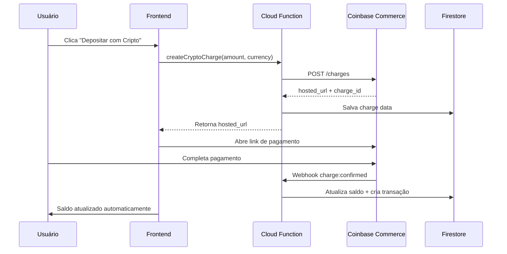

# 💰 Sistema de Depósitos Cripto - Coinbase Commerce

## ✨ Funcionalidades Implementadas

### 🔥 Backend (Firebase Cloud Functions)
- **`createCryptoCharge`**: Cria charges no Coinbase Commerce
- **`handleCryptoWebhook`**: Processa pagamentos confirmados
- **Conversão automática** para BRL com taxas atualizáveis
- **Transações atômicas** no Firestore para segurança

### 🎨 Frontend (React)
- **Modal moderno** para seleção de criptomoeda
- **Conversão em tempo real** para Reais
- **Integração seamless** com Coinbase Commerce
- **Feedback visual** do status do pagamento
- **Auto-refresh** do saldo após pagamentos

### 📊 Criptomoedas Suportadas
- **USDC** (USD Coin) - Stablecoin
- **USDT** (Tether) - Stablecoin  
- **ETH** (Ethereum) - Moeda nativa
- **BTC** (Bitcoin) - Moeda original

## 🔄 Fluxo Completo



## 📱 Interface do Usuário

### WalletCard Atualizado
- ✅ Botão **"Depositar PIX"** (tradicional)
- ✅ Botão **"Depositar com Cripto"** (novo)
- ✅ Botão **"Sacar"** (existente)
- ✅ Refresh automático após depósitos

### Modal de Depósito Cripto
- 🎯 Seleção intuitiva de criptomoeda
- 💱 Conversão automática BRL ↔ Crypto
- 🔗 Link direto para Coinbase Commerce
- ⏱️ Status em tempo real do pagamento
- 📊 Exibição das taxas de câmbio

## 🛠️ Para Deploy

### 1. Instalar Firebase CLI
```bash
npm install -g firebase-tools
firebase login
```

### 2. Deploy das Functions
```bash
cd functions
npm install
npm run deploy
```

### 3. Configurar Webhook
- URL: `https://<região>-<projeto-id>.cloudfunctions.net/handleCryptoWebhook`
- Eventos: `charge:confirmed`
- Dashboard: https://commerce.coinbase.com/dashboard/settings

### 4. Testar Integração
1. Fazer login na app
2. Clicar "Depositar com Cripto"
3. Testar com $1 USDC
4. Completar pagamento
5. Verificar saldo atualizado

## 🔒 Segurança Implementada

- ✅ **API Key protegida** no backend
- ✅ **Autenticação obrigatória** para criar charges
- ✅ **Validação de entrada** (valores, usuários)
- ✅ **Transações atômicas** no Firestore
- ✅ **Logs detalhados** para auditoria
- ⚠️ **Validação de webhook signature** (recomendado implementar)

## 📈 Próximos Passos

1. **Taxas Dinâmicas**: Integrar API de cotação real
2. **Mais Cryptos**: Adicionar outras moedas suportadas
3. **Histórico Detalhado**: Página dedicada para transações cripto
4. **Notificações**: Push notifications para pagamentos confirmados
5. **KYC/AML**: Compliance para valores maiores

## 🎯 Benefícios

- **Pagamentos Globais**: Aceita cripto de qualquer lugar
- **Baixas Taxas**: Menores que cartões tradicionais
- **Rapidez**: Confirmações em minutos, não dias
- **Transparência**: Blockchain pública e auditável
- **Inovação**: Posiciona a plataforma como tech-forward

---

**🚀 A plataforma agora aceita pagamentos em criptomoeda com total integração Coinbase Commerce!**